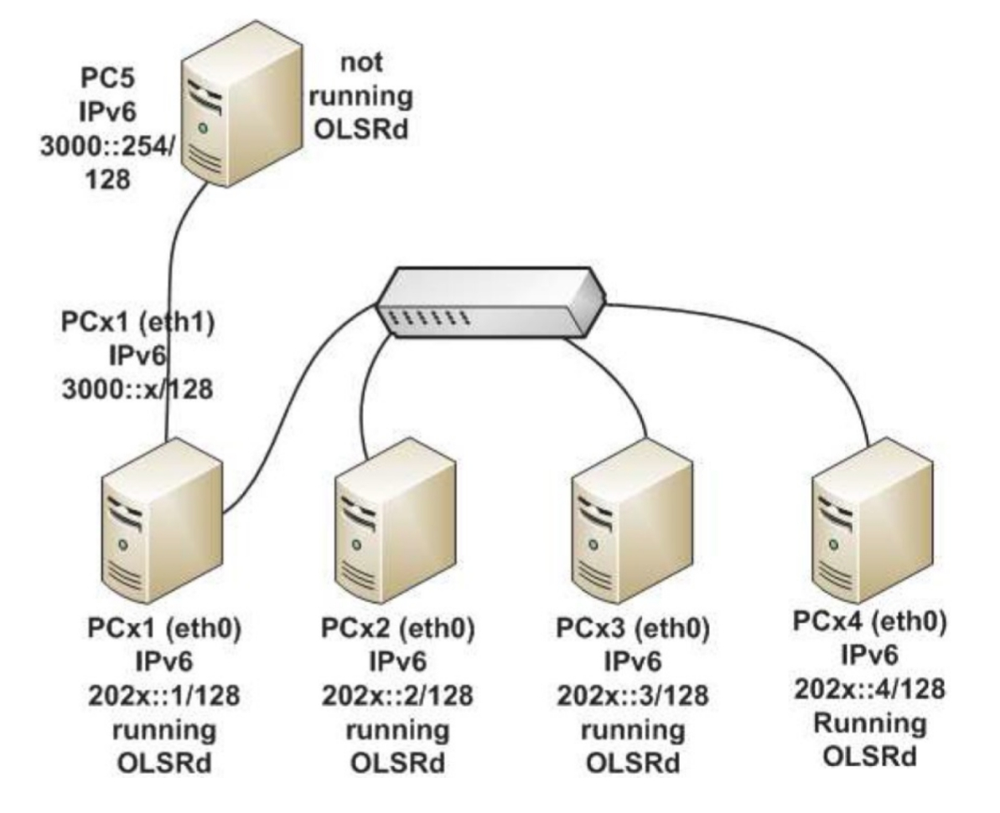
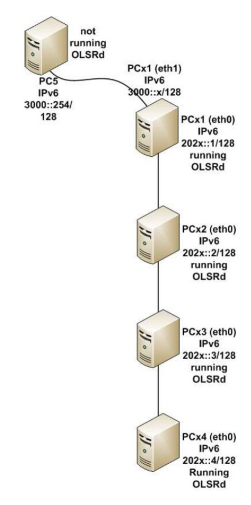
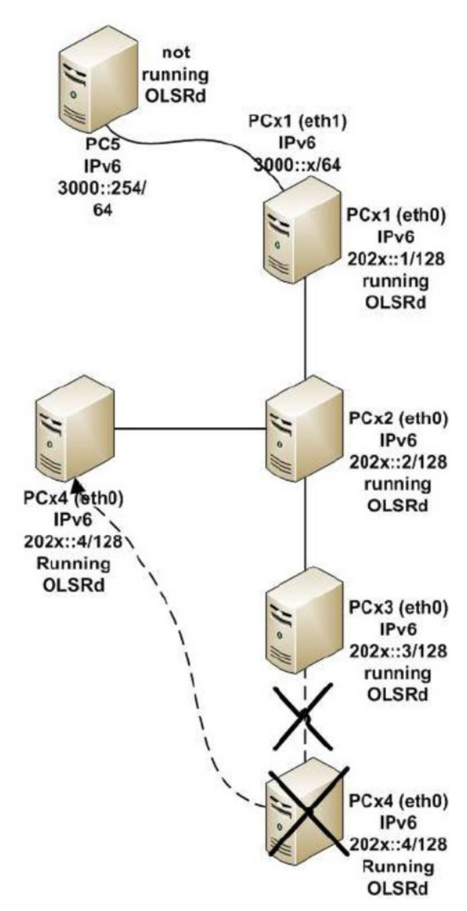

# OLSR and IPv6 using Mininet

This  work  was  prepared  by  Prof.  Manuel  Ricardo  and  Filipe  Abrantes,  and  later  updated  and
adapted to Mininet by Eduardo Nuno Almeida.
-------------------------------------------

This laboratory work consists in setting up an IPv6 ad hoc network controlled by the OLSR routing protocol. It is prepared to be  used in FEUP’s NetLab or using the Mininet network emulator. This guide is organized in three sections. The first section explains the Mininet software  that will be used to run an emulated network testbed replicating the testbed created in FEUP’s NetLab. __Read it carefully__, as it explains how to use Mininet, as well as how to run OLSR and Wireshark on Mininet. The  second  part  contains  the  original  OLSR  guide,  explaining  the  network  setup  and  tests  to perform. Please note that this guide corresponds to the original guide for the  OLSR lab  work, which was originally thought to be done in FEUP’s NetLab. As such, all configurations related to a “PC” should be applied to the corresponding Mininet host (e.g., PC1 corresponds to Mininet host h1). The final section contains the questions that **should** be answered on the final report.

# 1. Mininet

In this work, we will use the Mininet software to emulate a wireless network testbed. Mininet is a  network emulator  which  creates  a  network  of  virtual  hosts,  switches,  controllers  and  links. Mininet hosts are virtualized in Linux network namespaces, which allows the creation of multiple independent TCP/IP network stacks. Also, since they are running on top of the Linux kernel, all Linux software works exactly in the same way.
More information on Mininet is available on their [website](http://mininet.org/overview)

## 1.1 Mininet Instalation

Mininet runs on the Linux kernel. Therefore, in order to set-up the Mininet testbed, we will use a standard Linux distribution (e.g., Ubuntu) on a Virtual Machine (VM) or installed directly on a PC. The official Mininet  website provides a prebuilt VM based on Ubuntu 14.04 with all packages already installed. However, this VM does not support IPv6, nor does it contain a graphical user interface. Therefore, we will install Mininet through Ubuntu’s package manager (apt-get). The complete instructions  to  install  Mininet  are  provided  on  this  website.  Ignore  the  Software  Defined Network (SDN) parts (the controller and switch), as they are not used in this work.

[Mininet Installation Link](http://mininet.org/download/#option-3-installation-from-packages)

To install Mininet, run this command on the terminal:

```bash
$ sudo apt-get update
$ sudo apt-get install mininet xterm
```

To check that everything is working well, run a pingall command on Mininet. This command will
create  a  basic  network  topology  (2  hosts  connected  through  a  switch)  and  perform  a  ping
between both hosts.

```bash
$ sudo mn --test pingall
```

## 1.2 Mininet Command Line Interface (CLI)

After starting an instance of Mininet, the Mininet network is controlled through the CLI on the
terminal. The Mininet CLI is explained in this [website](http://mininet.org/walkthrough/#part-3-mininet-command-line-interface-cli-commands). In this guide, running commands on the Mininet CLI means that those commands should be run on the Linux terminal where Mininet was launched. This is indicated by the prefix ``$ mininet>`` on the terminal.
To  start  a  minimal  Mininet  instance,  run  these  commands  (NOTE:  Mininet  must  always  be
launched with root permissions -- i.e., using sudo):

```bash
$ sudo mn   # Start Mininet with a minimal topology (2 hosts + 1 switch) 
$ sudo mn --help   # See Mininet help and the list of flags
```

After starting a Mininet instance, the network is controlled through the CLI. To see all available
commands in the CLI, run this command on the Mininet CLI:

```bash
$ mininet> help
```

To exit Mininet, run this command on the Mininet CLI:

```shell
$ mininet> exit
```

There are two methods to run Linux commands on a specific host.

1. Run the command on the Mininet CLI prepending the host on which we want to apply the command. For instance, if we want to run ifconfig on host h1:

```bash
$ mininet> h1 ifconfig
```

2. Launch  a  dedicated  terminal  for  each  host.  This  terminal  allows  us  to  run  commands directly on that host, without needing to prepend the commands with the host name (e.g., h1, h2, ...).__This is the preferred method for this work__, since it allows us to have one terminal per host, similar to a real testbed. To launch a terminal for host 1 and run ifconfig on the newly created terminal, we can simply run this command on the Mininet CLI:

```bash
$ mininet> xterm h1
$ ifconfig #On the newly created terminal
```

A useful shortcute to start Mininet with dedicated terminals for every host is to add he flag "-x"when starting a Minint instance (i.e. , ``$ sudo mn -x``)

## 1.3 Association Between Physical and Mininet Network Interfaces

Since  Mininet virtualizes each host’s TCP/IP  network  stack,  each  host  has  its  own  network interface.  The  interface  created  by  Mininet  for  a  host  can  be  seen  by  running  ifconfig  on  the host’s terminal. The convention Mininet uses is “hx-eth0”, where x is the host number (e.g., h1-eth0). Therefore, throughout  this guide, when referring to the eth0 network interface of  PCx, you should instead refer to the Mininet interface “hx-eth0”. Similar to a real testbed, each host in Mininet only has access to its own interface (e.g., h1 can’t access h2 interface). However, the Linux PC (outside Mininet) has access to all hosts’ interfaces (e.g., s1-eth1, s1-eth2, ...).

## 1.4 Running OLSR in Mininet

In  Mininet,  only  the  network  stack  is  virtualized  (contrary  to  a  full  container).  This  has  two consequences. First, the OLSR daemon (olsrd) only needs to be installed once in the Linux PC, since  all  hosts  share  the  filesystem.  Second,  the  OLSR  daemon  (olsrd)  does  not  allow  the execution  of  multiple  instances  on  the  same  machine.  The  OLSR  daemon  checks  if  there  is another instance of olsrd running through a temporary lock file created in “/var/run/olsrd-ipv6.lock”. In order to circumvent this limitation, we must remove this file before starting a new instance of olsrd on another host.

## 1.5 Running Wireshark in Mininet

Given the association between physical and Mininet network interfaces, there are two methods to run Wireshark on the hosts:

1. Launch Wireshark on the host’s terminal (you can continue to use the terminal normally after wireshark is launched). This method resembles a real testbed, where each host has its own Wireshark.

```bash
$ sudo wireshark &
```

2. Create a new terminal on Linux (outside Mininet), start Wireshark and capture all the virtual interfaces representing each host (e.g., s1-eth1, s1-eth2, ...). NOTE: Since we are capturing all interfaces simultaneously, we will need to apply filters when analyzing the logs in order to separate traffic from each host.

```bash
$ sudo wireshark &
```

## 1.6 Additional Provided Files

When using Mininet, you should have two additional files provided in Moodle:``mininet_olsr_topology.py`` and ``mininet_topology_changer.sh``. The Python script mininet_olsr_topology.py defines the network topology to be used in Mininet. The file mininet_topology_changer.sh is the updated bash script to change the topology of the network. Contrary to the use of original topology_changer in FEUP’s NetLab, this script should be run within each host’s terminal. Place  these  files  on  a  directory  of  your  choice  and  give  the  mininet_topology_changer.sh execution permissions. ``$ sudo chmod +x mininet_topology_changer.sh``

## 1.7 Start the Mininet Network

To start a Mininet instance representing the wireless network testbed, run this command on a
Linux terminal, where ``<absolute_path_to_mininet_olsr_topology.py>`` should be the
absolute path to the mininet_olsr_topology.py script file (e.g.,``/home/eduardo/como/mininet_olsr_topology.py``).

```bash
$ sudo mn -x --switch=ovsbr --controller=none 
     --custom=<absolute_path_to_mininet_olsr_topology.py> 
     --topo=olsr_topo
```

# 2. Optimized Link State Routing (OLSR)

This section contains the guide for the OLSR lab work. Some hints before starting this work on FEUP’s NetLab are listed below.

- __HINT 1__: You can  apply filters in Wireshark when analyzing the captured logs, in order  to  only show traffic from / to a given IP / MAC, application, and so on.
- __HINT  2  (NetLab)__:  Check  that  the  cables  on  your  network  stand  are  correctly  connected,  the switch ports are on the same VLAN, and the network settings on the PCs are clear.
- __HINT 3 (NetLab)__: Instead of constantly switching the PC monitor, you can use one of the PCs as the main working PC and connect to the remaining PC via SSH, with “-X” to redirect the graphical user interface of Wireshark. You can then launch Wireshark with``$ sudo wireshark &``.
- __HINT 4 (NetLab)__: When using FEUP’s NetLab, it is recommended to generate pairs of SSH keys between the PC where you are issuing the topology_changer-sh command to the remaining PCs. This avoids the need to input the PC password multiple times, which affects the timing of the
  network disconnection during topology reconfigurations.

```bash
$ ssh-keygen -t rsa 
$ ssh-copy-id root@tuxX1 
$ ssh-copy-id root@tuxX2 
$ ssh-copy-id root@tuxX3 
$ ssh-copy-id root@tuxX4
```

## 2.1 Introduction

This work consists in setting up an Ad-Hoc network controlled by the OLSR protocol. Due to the impracticalities of using wireless interfaces in FEUP Netlab, i.e., all nodes would be able to see every other node, thus using routing would be useless; we'll simulate the Ad-Hoc network using wired interfaces connected to the same switch and blocking connectivity between some of the nodes.

## 2.2 Network Interfaces Setup

Each group has a stand (bancada) with 4 PCs where you are going to setup OLSRd. You'll have to perform the following steps in each one of them. First, make sure you run these commands:

```bash
$ echo 0 > /proc/sys/net/ipv6/conf/eth0/accept_ra 
$ ifconfig eth0 down && ifconfig eth0 up   # Not necessary in Mininet 
$ dhclient eth0                            # Not necessary in Mininet 
$ echo 1 > /proc/sys/net/ipv6/conf/eth0/forwarding
```

The  first  command  disables  Routing  Advertiser  (RA)  messages.  RAs  are  used  as  a  link  local mechanism for neighbor discovery, but because the nodes are going to be routers and use global addresses, RAs are not needed in our scenario. If you want to learn more about it check RFC2462.
The  second  command  resets  the  IP  configuration  in  interface  eth0.  The  third  sets  the  IPv4 configuration  for  the  interface  which  is  going  to  be  needed  later  to  download  packages,  and finally  the  fourth  makes  sure  that  forwarding  is  enabled.  This  is  a requirement  for  routing packets.

## 2.3 OLSR Installation and Configuration

The OLSR daemon (``olsrd``) can be installed through the Linux package manager (e.g., ``apt-get``) or
building  it  manually.  To  install  olsrd  through  Ubuntu’s  package  manager,  simply  run  the following command on a Linux terminal:

```bash
$ sudo apt-get update 
$ sudo apt-get install olsrd
```

If  olsrd  is  not  available  through  the  OS’s  package  manager install  it  manually  running  the following commands in a Linux terminal:

```bash
$ git clone --depth=1 https://github.com/olsr/olsrd.git 
$ cd olsrd/ 
$ make && make install
```

The OLSR daemon is configured by editing a special configuration file on Linux. A sample of this file is already installed in the directory /etc/olsrd/olsrd.conf. To configure OLSR for this work, we will create a configuration file for each PC based on the sample. To edit the files, use
your favorite editor (e.g., nano or vim) using sudo. To create the configuration files, create one copy of the sample configuration file and place it on the same directory, but with the name “olsrdX.conf”, where X corresponds to the PC number. Edit this file with the configurations below. Then, create multiple copies of this edited file for the remaining PCs and change the network interface part.

__NOTE (Mininet)__: When using Mininet, remember two things. First, we need separate configuration files for each host (on a real testbed, each PC would only have its own configuration file). Second, each PC’s eth0 network interface must be changed to the Mininet counterpart (e.g., PC1 is “h1-eth0”, PC2 is “h2-eth0”, ...).

__NOTE (NetLab):__ When using FEUP’s NetLab, you can edit the configuration files on one PC and copy  them  to  the  other  PCs  in  your  stand.  For  that  purpose,  you  can  use  the  secure  copy command: e.g., ``$ scp /etc/olsrd/olsrd1.conf tux21:/etc/olsrd/olsrd1.conf``

The configuration for each host is given below. The explanation of each command is given in the ``olsrd’s``  man  page  and  the  line  comments  next  to  the  command.  To  edit  the  general  OLSR configurations,  search  the  file  for  the  lines  indicated  below  and  check  /  replace  the  value  as indicated below:

```bash
DebugLevel                1 
IpVersion                 6 
LinkQualityLevel          0 
MprCoverage               1
```

To  configure  the  interfaces  where  OLSR  will  run,  create  a  new  interface  block  by  adding  this configuration to the end of the file. Remember that HelloInterval is the interval between HELLO messages which are responsible for letting nodes know their neighbors. TcInterval is the interval between  Topology  Control  (TC)  messages  which  are  responsible  for  spreading  the  Ad  Hoc network topology to all nodes. HnaInterval is the interval between Host and Network Association (HNA) messages responsible for advertising network routes.

```bash
Interface “eth0” 
{ 
HelloInterval           6.0 
HelloValidityTime       60.0 
TcInterval              10.0 
TcValidityTime          60.0 
HnaInterval             10.0 
HnaValidityTime         60.0 
}
```

## 2.4 Testing a Static Scenario

__Important:__ After downloading and installing the packages olsrd on  ALL computers, you  MUST disconnect the cable that connects the switch in your stand to the Internet (it should be a red ended cable). If you do not do this, then your routers will see the OLSR packets sent by routers on the other stands and the exercises won’t function properly.
Before starting make sure that your tuxX1 (where X is the stand number) second interface (eth1) is physically connected to the lab IPv6 Router. Read carefully the Physical Topology below.

### 2.4.1 Configuring the IPv6 Addresses

As mentioned before each group will have a stand X with 4 PCs running OLSRd connected to a switch (e.g. BayStack 420-24T Switch). Each PC should be configured with an global IPv6 address 202X::Y/128, where X is the stand and Y the PC number (e.g. tux32 in stand 3 will have its eth0 configured with the global address 2023::2/128). This configures a different IPv6 network in each of the nodes, so we will end up with four different IPv6 networks.
__NOTE (Mininet)__: When using Mininet, you can choose any number for the stand X (1-6). Setting a global IPv6 address for PC Y in Stand X:

```bash
$ sudo ifconfig eth0 inet6 add 202X::Y/128
```

Additionally,  the  first  PC,  tuxX1  (tux31  if  you  are  on  stand  3),  will  have  a  second  interface connected  to  an  IPv6  infrastructured  network,  which  must  be  configured  with  a  global  IPv6 address 3000::X/64 (e.g. tux31 in stand 3 will have its eth1 configured with the global address 3000::3/64).  Another  IPv6  Router  was  previously  set  up  on  that  network  (don't  worry  about configuring this router) with the global IPv6 address 3000::254/64.

__NOTE (Mininet)__: When using Mininet, you must configure this router (PC5). The instructions are on Section 2.6. Setting a global IPv6 address for PC1 in Stand __X__:

```bash
$ sudo ifconfig eth1 up 
$ sudo ifconfig eth1 inet6 add 3000::X/64
```

### 2.4.2 Physical Topology

The physical connection of the second interface in your tuxX1 was also previously set up, but in
case of any problems, check if that interface is connected to stand 1 or 4. If you are on stands 1-
3, connect this interface to stand 1 (e.g. in stand 3 you connect for instance to 3.13-1.17). If you
are  on  stand  4-6,  then  you  connect  this  interface  to  stand  4  (e.g.  in  stand  6  you  connect  for
instance to 6.13-4.17).
The picture below shows the physical topology of the network.



### 2.4.3 Emulated Ad-Hoc Topology

This  is  not  enough.  To  emulate  the  Ad-Hoc  topology  we  want  to  test,  we  need  to  use  MAC filtering - we will emulate that a node only "sees" a subset of other nodes by filtering the packets from  the  nodes  we  don't  want  him  to  "see".  This  needs  special  attention  when  analyzing Ethereal logs as Ethereal will capture those packets. This can also be done using VLANs in the switches, you can go that way if you are able to change the switches VLANs. The mac filtering is done using ip6tables rules.

__NOTE:__ ip6tables operates at the network layer (IP). herefore, network packets will still be sent and received between the PCs but are discarded by ip6tables before being processed. Remember this when analyzing the logs in Wireshark.The picture below represents the first ad hoc scenario we want to emulate, where nodes are all inline:



To automatically set the topology above you can use a bash utility developed for this purpose.
There are two versions of this script, depending if you are running this work on Mininet or FEUP’s
NetLab.

```Bash
Mininet 
This script should be run on every PC. 
Usage: $ ./mininet_topology_changer.sh <topology_number> 
     topology_number: 
          - 0 for full mesh (every node sees every other node) 
          - 1 for line scenario (1-2-3-4) 
          - 2 for star topology centered on node 2 
```

```Bash
FEUP’s NetLab 
This script should be run only once on one of the PCs. This means that 
if you run the command on tuxX1, you don't need to run it on tuxX2, 
tuxX3 or tuxX4. 
Usage: $ topology_changer <bancada> <topology_number> 
     bancada: 1-6 
     topology_number: 
          - 0 for full mesh (every node sees every other node) 
          - 1 for line scenario (1-2-3-4) 
          - 2 for star topology centered on node 2 
```

In case you want to check if everything is ok, execute the following command in the PCs:

```bash
sudo ip6tables -L
```

You should see in the INPUT chain, one mac-filter rule per MAC address it needs to block. So, if you execute this in PC1, you'll see PC3 and PC4 mac addresses blocked. PC1 will only "see" PC2.
__IMPORTANT__: You may want to cross-check the ip6tables rules with the MAC addresses of the eth0 interfaces of your stand. Sometimes the network interface cards are replaced (and so are the  MAC addresses)  due  to  hardware  failure.  If  you  find  any  inconsistency,  change  the topology_changer script and run it again.

### 2.4.4 The Actual Test

To test the setup, we need to start olsrd on PC1, PC2, PC3 and PC4 (the IPv6 router will not run olsrd). To start olsrd, run the following command on each PC:

```$ sudo olsrd -f /etc/olsrd/olsrdX.conf # Where X is the PC number ```

__NOTE__: If the configurations are correct, the process will automatically fork and detach from the
terminal. If you do not want the process to detach, add the flag “-nofork”.
Now check the connectivity from PC4 to PC1 using the ping6 utility on PC4:

```$ ping6 202X::1 ```
You can list the kernel IPv6 routes by running the route command. Check that the routes to the
other PCs are correctly listed (it may take a few seconds to update the routing table):
```$ route -n6 ```
__NOTE__: Use Wireshark to capture packets in all the PCs during the test. They will be needed to
answer some questions later. You can use ping6 to test/measure the time that two nodes stay
connected. You may want to reduce ping6 interval with -i interval.

## 2.5 Simulating Mobility

Now we are going to simulate mobility scenarios, for example like the one shown below:




To  automatically  set  the  topology  above  you  can  use  the  bash  utility  again.  So,  if  you  are  on
stand 3, to set the above topology you just have to type the following command.

```bash
(Mininet – On every PC):   $ ./mininet_topology_changer.sh 2 
(NetLab – Only on one PC): $ topology_changer 3 2
```

And it is all set, the routes should be reconfigured in a few seconds (you should measure the time it takes to reconfigure the routes - using ping6 for instance. You may want to reduce ping6 interval with -i interval) You are welcome to test other mobility scenarios if you want to change the topology_changer.sh script, or/and to alter olsrd parameters (in the configuration file or you can use them as command line parameters) and evaluate their relation with the time required to reconfigure the routes.

It  would  also  be  interesting  to  measure  (not  very strict  –  just  to  have  an  idea)  the  average bandwidth used by  the protocol messages in each link (beware of  the MAC filtering  trick), as well as the size of the messages (especially the HELLO and TC messages sent by PC2 before and 
after PC4 has moved). 

__NOTE__: Use Wireshark to capture packets in all the PCs during the test. They will be needed to answer some questions later. 

## 2.6 Ad Hoc ↔ Infrastructure 
Now let's  test another feature of the  OLSR routing protocol  which is the  Home and Network Association (HNA). It can be used to establish communication between an Ad Hoc network and an infrastructured one (where nodes aren’t running olsrd, just like PC5). Let's assume PC5 is in the infrastructured network and that PC1 is gateway between the Ad Hoc and the infrastructured network. PC5 has been previously set up with the IPv6 global address 3000::254/64 and with a route for each stand Ad-hoc network. In case you need to set a different PC5, the commands that have been inserted in PC5 are:
```bash 
$ sudo ifconfig eth0 inet6 add 3000::254/64 
$ sudo route -A inet6 add 202X:0:0::/64 gw 3000:: 
```
Try pinging PC5 from PC4: 
``ping6 3000::254 ``
This  doesn't  work  (at  least  if  you  have  followed  all  the  steps  of  the  configuration  rightfully), because PC4 doesn't have a route for PC5. This is when we will introduce the OLSR HNA feature. In PC1, edit the olsrd configuration file ``"/etc/olsrd/olsrd1.conf"``, search for the ``“Hna6”`` configuration block and uncomment the “Internet gateway” configuration (see below): 

```Hna6 
{ 
# Internet gateway: 
:: 0 
# more entries can be added: 
# fec0:2200:106:: 48 
}
``` 
Restart  the olsrd daemon (only at PC1). This will cause that all Ad Hoc nodes create a default route using PC1 as the gateway. Now try again to ping PC5 from PC4... it works. You have just integrated an infrastructured network with an Ad Hoc one. 

Also try a traceroute from PC4 to PC5 so you are sure everything is working as expected: 
``$ traceroute6 3000::254 ``
If everything is well set up the path will be: PC1 → PC2 → PC3 → PC4 (for the line topology). 

__NOTE__: Use Wireshark to capture packets in all the PCs during the test. They will be needed to answer some questions later. 
## 2.7 Understanding Multi-Point Relayers (MPR) 
One of the major features of OLSR for wireless link are the so called Multi-Point Relayers which are intended to optimize the way relevant information such as Topology Control (TC) or Home and Network Association (HNA) messages, are disseminated throughout a MANET. With MPRs unnecessary transmissions are kept to the minimum possible so that all nodes in the MANET get the information. To know more you can read OLSR RFC  and the paper Multipoint relaying for flooding broadcast messages in mobile wireless networks. In this section, you should test the 2 scenarios described in sections 2.4 (line topology) and 2.5 (star  topology),  and  for  each  of  them  identify  which  nodes  are  elected  as  MPRs (based  on Wireshark captures) and argue if these are the ones that you expected or not. 
# 3. Questions 
Write a short report answering the following questions: 
 
1. Imagine that we would use IPv4, and that PC1 address was for instance 169.254.1.1/16. 
What would be the destination IP address of the HELLO packets sent by PC1? Assume 
that the Ipv4Broadcast configuration of the OLSR daemon is not set. 
 
2. Based on the logs collected determine how much bandwidth-per-node does the OLSR 
protocol consume in both scenarios. Hint: you can use Wireshark’s tool in “Statistics > 
Protocol Hierarchy”. 
 
3. When node 4 moves, there is a period during which there is no network connectivity. 
Measure this time period and find a relation between its duration and the HelloInterval 
and TcInterval parameters. 
 
4. In the mobility scenario, the topology of the network changes after node 4 moves. Based 
on the Wireshark logs, identify which nodes act as Multi-Point Relayers before and after 
the  topology  change.  Briefly  explain  how  the  MPR  selection  can  be  verified  on  the 
Wireshark logs. 
 
5. (Mininet) Throughout the OLSR guide (section 2), several network configurations had to 
be made, including routing flags, IPv6 settings and addresses. Taking advantage of the 
Mininet Python API (see the links in the next section), explain how you can make these 
network configurations directly on the mininet_olsr_topology.py Python script. 
 
6. (Mininet)  Consider  the  scenario  explained  in  section  2.5  where  the  network  topology 
changes from line to star. Is it possible to change the network topology at runtime (i.e., 
without  stopping  and  restarting  Mininet)  using Mininet’s API instead of the provided 
mininet_topology_changer.sh  script?  Briefly  explain  how  you  would  do  this,  or 
why it is not possible. 
__HINT__: Remember that Mininet supports Software-Defined Networking (SDN). 
# 4 Links and References 
## OLSR 
- Optimized Link State Routing Protocol (OLSR): http://www.ietf.org/rfc/rfc3626.txt 
- OLSRd Linux daemon: http://www.olsr.org/ 
- Linux IPv6 HOWTO: http://tldp.org/HOWTO/Linux+IPv6-HOWTO/index.html 
- IPv6 syntax 
- IPv6 address types 
- ``$ man olsrd`` 
- ``$ man olsrd.conf`` 
 
## Mininet 
- Overview: http://mininet.org/overview/ 
- Walkthrough: http://mininet.org/walkthrough 
- Python API: http://mininet.org/api/annotated.html 