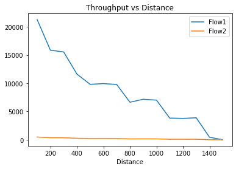
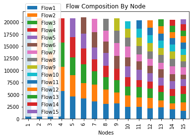
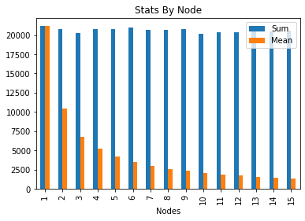
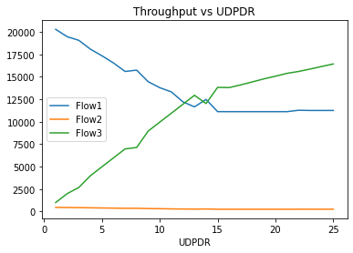
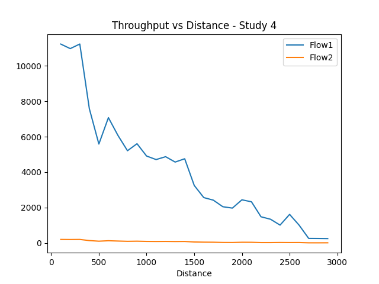
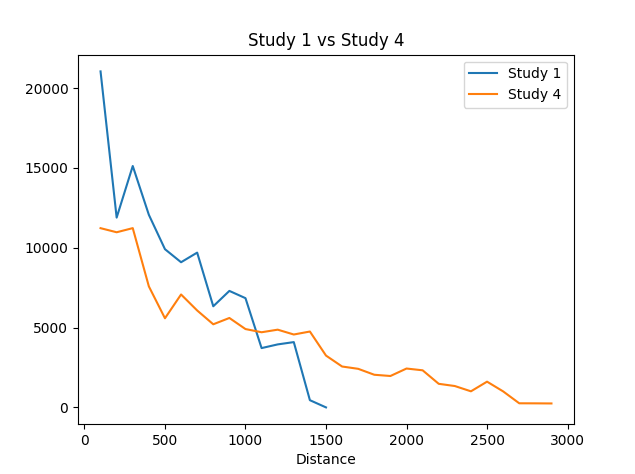

# Mobile Communications
## Faculdade de Engenharia da Universidade do Porto
### Network Simulation – WiFi
### Martinho Figueiredo (201506179)
### Pedro Cruz (201504646)
## First Study – Throughput vs distance
For this study we have created python code to run and log the results of the scenario described in the first study. The main goal was to visualize the effects of the distance on the throughput of a connection. We concluded the TCP flow decreases with distance until it reaches the 1500 distance, where the throughput showed is zero.
In this study we have concluded that the longer the distance, the lower the throughput, as expected





## Second Study - Throughput vs number of STAs 
In the same way we have created a similar python code to execute and visualise the results. The objective this time is to understand the impact of multiple stations (STAs) in the throughput. 
In this study we reach the conclusion that the throughput maximum will be divided by the number of STA and each of them will work with their percentage of the maximum. To note that there might be some cases that one of the STA will drop but still the throughtput will be divided by the rest of the STA's





## Third Study
Here we see that the TCP (`flow1`) throughput, due to its flow control will diminish, at the same time as the bitrate of UDP (`flow2`) will increase. It was expected since TCP is a connection-oriented protocol versus UDP which is a connectionless protocol



## Fourth Study
Comparing the 4th stufy with the first we see that the use of a relay allowed for double of the transmission range. 






# Anexo CODIGO


```python

import subprocess
import re
import pandas as pd
import numpy as np
import matplotlib.pyplot as plt


%cd /home/mobile/ns-allinone-3.35/ns-3.35

duration = 30

def first_study(start=100,stop=1500,step=100,duration=60, manual=False):
    

    print('--- First Study ---\n')

    if(manual): 
        print("Input Test Values")
        start = input('Limite Min?')
        stop = input('Limite Max?')
        step = input('Passo?')
        duration = input('Duracao?')

        
        

    regex = r"       Throughput: (-\d||\d+.\d+||-\d+.\d+) Kbps"

    rx = re.compile(regex)

    df = pd.DataFrame(columns=['Flow1','Flow2','Distance'])

    for distance in range(start,stop+step,step):
        i = int (distance - start)/step 
        print(f'Distance is {distance}m, iteration {i}, running command:\n    ./waf --run "scratch/first_study --distance={distance} --duration={duration}"')
        process = subprocess.run([f'./waf --run "scratch/first_study --distance={distance} --duration={duration}"'], shell=True, check=True, stdout=subprocess.PIPE, universal_newlines=True)
        output = rx.findall(process.stdout)
        print(i)
        print(process.stdout)
        print(output)
        while(len(output)<2):
            output.append(0)
        print(f'Throughput Results:\n    Flow 1 -> {output[0]} Kbps\n    Flow 2 -> {output[1]} kbps\n\n')
        df.loc[int(i)] = output+[distance]

    df[:] = df[:].astype(float)
    df.plot(x='Distance', kind='line', y=["Flow1","Flow2"], title='Throughput vs Distance')
    return(df)


def second_study(start=1,stop=15,step=1,duration=30,manual=False):
    print('--- Second Study ---\n')

    if(manual):
        start = input('Limite Min?')
        stop = input('Limite Max?')
        step = input('Passo?')
        duration = input('Duracao?')

    str = ['Nodes']
    for nodes in range(start,stop+step,step):
        i = int ((nodes- start)/step)
        str.append(f'Flow{i+1}')

    df = pd.DataFrame(columns=str,index=range(stop),dtype= np.float64)

    regex =r"Flow ID: .+ Src Addr 10\.0\.0\..* Dst Addr 10\.0\.0\.1\n       Tx Packets = .*\n       Rx Packets = .*\n       Throughput: (-\d||\d+.\d+||-\d+.\d+) Kbps"
    rx = re.compile(regex)
    list = []
    for nodes in range(start,stop+step,step):
        i = int (nodes- start)/step 
        list.append(i)
        print(f'Duration is {duration}m, nodes {nodes}, running command:\n    ./waf --run "scratch/second_study --duration={duration} --nr_of_senders={nodes}"')
        process = subprocess.run([f'./waf --run "scratch/second_study --duration={duration} --nr_of_senders={nodes}"'], shell=True, check=True, stdout=subprocess.PIPE, universal_newlines=True)
        output = rx.findall(process.stdout)
        print(process.stdout)
        while(len(output)<stop+1):
            output.append(np.nan)
        output=[f'{int (nodes)}']+output
        print(output)    
        df.loc[i] = output
        print(f'Throughput Results:\n    Flow {*list,} -> {*output,} Kbps\n')

    df[str[1::]] = df[str[1::]].astype(float)

    dfstats = pd.DataFrame()
    dfstats.loc[:,'Nodes'] = df.loc[:,'Nodes']
    dfstats.loc[:,'Sum'] = df.sum(numeric_only=True, axis=1)
    dfstats.loc[:,'Mean'] = df.mean(numeric_only=True, axis=1)

    df.plot(x='Nodes', kind='bar', stacked=True,title='Flow Composition By Node')
    dfstats.plot(x='Nodes', kind='bar', stacked=False,title='Stats By Node')

    
    #print('--- DATA ---')
    #print(df)
    #print(df.dtypes)
    #print('--- STATS ---')
    #print(dfstats)
    #print(dfstats.dtypes)
    return(df, dfstats)


def third_study(start=1,stop=25,step=1,duration=1,manual=False):
    print('--- Third Study ---\n')

    if(manual):
        print("Valores para o UDP data rate")
        start = input('Limite Min?')
        stop = input('Limite Max?')
        step = input('Passo?')
        duration = input('Duracao?')
            
    udpdr = start
    regex = r"       Throughput: (-\d||\d+.\d+||-\d+.\d+) Kbps"
    rx = re.compile(regex)
    df = pd.DataFrame(columns=['Flow1','Flow2','Flow3','UDPDR'],dtype= np.float64)
    for udpdr in range(start,stop+step,step):
        i = int (udpdr- start)/step 
        print(f' # {int(i)} -_Duration is {duration}m, UDP Data Rates {udpdr}Mbps, running command:\n    ./waf --run "scratch/third_study --duration={duration} --udp_data_rate={udpdr}Mbps"')
        process = subprocess.run([f'./waf --run "scratch/third_study --duration={duration} --udp_data_rate={udpdr}Mbps"'], shell=True, check=True, stdout=subprocess.PIPE, universal_newlines=True)
        output = rx.findall(process.stdout)
        print(process.stdout)
        print(output)
        print(f'Throughput Results:\n    Flow 1 -> {output[0]} Kbps\n    Flow 2 -> {output[1]}  Flow 3 -> {output[2]} Kbps\n\n')
        df.loc[i] = output+[udpdr]
    
    df[:] = df[:].astype(float)
    df.plot(x='UDPDR', kind='line', y=["Flow1","Flow2","Flow3"], title='Throughput vs UDPDR')
    return(df)

def fourth_study(start=100,stop=3000,step=100,duration=10, manual=False):
    print('--- Fourth Study ---\n')

    if(manual):
        start = input('Limite Min?')
        stop = input('Limite Max?')
        step = input('Passo?')
        duration = input('Duracao?')

    distance = start 

    cmd = f'./waf --run "scratch/fourth_study --distance={distance} --duration={duration}"'
    regex = r"       Throughput: (-\d||\d+.\d+||-\d+.\d+) Kbps"
    rx = re.compile(regex)
    df = pd.DataFrame(columns=['Flow1','Flow2','Distance'],dtype= np.float64)
    for distance in range(start,stop,step):
        i = int (distance - start)/step 
        print(f'#{int (i)} Distance is {distance}m, duration {duration}, running command:\n    ./waf --run "scratch/fourth_study --distance={distance} --duration={duration}"' )
        process = subprocess.run([f'./waf --run "scratch/fourth_study --distance={distance} --duration={duration}"'], shell=True, check=True, stdout=subprocess.PIPE, universal_newlines=True)
        output = rx.findall(process.stdout)
        print(process.stdout)
        print(output)
        df.loc[i] = output+[distance]
        print(f'Throughput Results:   Flow 1 -> {output[0]} Kbps    Flow 2 -> {output[1]} Kbps\n\n')

    df[:] = df[:].astype(float)
    df.plot(x='Distance', kind='line', y=["Flow1"], title='Throughput vs Distance - Study 4')
    

    
    #Reruns Study 1
    #ax = first_study(stop=stop,duration=duration).plot(x='Distance', kind='line', y=["Flow1"], title='Study 1 vs Study 4')
    
    #Uses pre calculated data
    ax = df1.plot(x='Distance', kind='line', y=["Flow1"], title='Study 1 vs Study 4')
    
    
    df.plot(ax=ax, x='Distance' ,y=["Flow1"])
    ax.legend(["Study 1", "Study 4"])
    
    return(df)

```